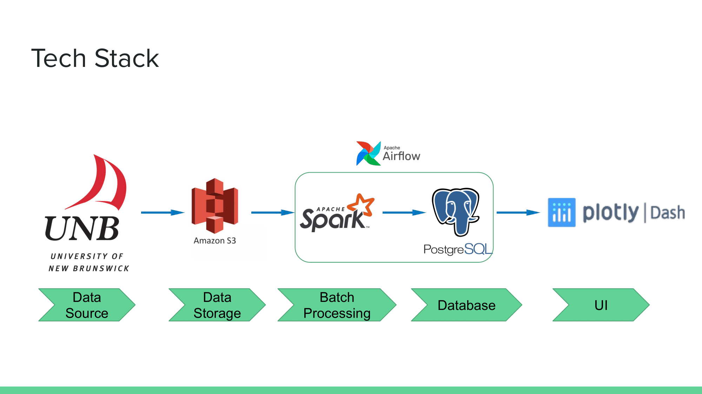

# Network_Visionary

Monitor your network

<!-- TABLE OF CONTENTS -->

## Table of Contents

* [About the Project](#about-the-project)
* [Data Resource](#data-resource)
* [Tech Stack](#tech-stack)
* [Frontend](#Frontend)
* [Challenges](#challenges)
* [Future Improvements](#future-improvements)

## About the Project

The rise in cyberattacks is the elephant in the room. To secure your network, cyber defenders have to perform a list of tasks. Network analysis is one of the most important parts of cyber defense, however the tools, Wireshark/Tshark, which cyber defenders used widely are still text-based and sometimes provide too much unncessary information.

This project aims to build an ETL pipeline from pcap file to visualized frontend to help users to gain a better picture of their network.

## Data Resource

The data is from an open source [dataset](https://www.unb.ca/cic/datasets/) provided by University of New Brunswick. Three different datasets were used, the total size is over 500GB, yet not entire dataset is used in this project.

## Tech Stack

## Frontend

(To be added)

## Challenges 

## Future Improvements

